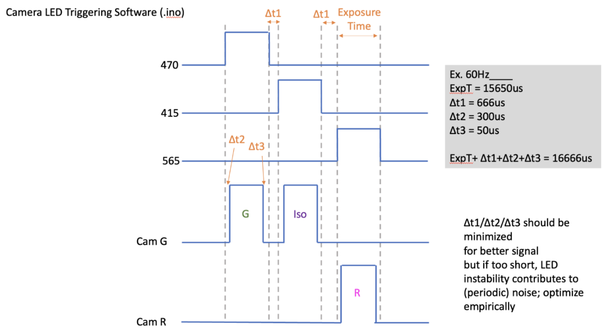

A [Cuttlefish](https://github.com/AllenNeuralDynamics/harp.device.cuttlefish) adapted to a dedicated fiber photometry application.

## Waveform Parameter Overview
This firmware generates the waveform below.

Multiple parameters are configurable:
* Continuous, or iterations
* software-trigger to start waveform generation
* `EVENT` message emitted upon rising edge of any camera trigger (configurable)
